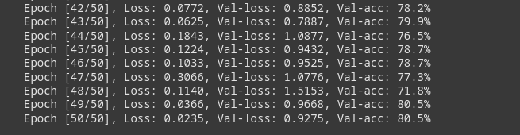
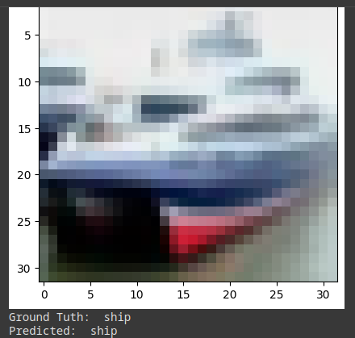

# 1. Classic CNN implementation, for classification applications

A traditional Convolutional Neural Network implementation for image classification on the CIFAR-10 dataset.

## 📊 Results
- **Final Validation Accuracy**: 80.5%
- **Training Epochs**: 50
- **Optimizer**: SGD (lr=0.008)
- **Loss Function**: CrossEntropyLoss

## 🏗️ Architecture
```python
Conv2d(3, 64, kernel_size=4) → ReLU → MaxPool2d(3,2)
Conv2d(64, 192, kernel_size=4) → ReLU → MaxPool2d(3,2)  
Conv2d(192, 384, kernel_size=3) → ReLU
Conv2d(384, 256, kernel_size=3) → ReLU
Conv2d(256, 256, kernel_size=3) → ReLU → MaxPool2d(3,2)
Linear(1024, 512) → ReLU → Dropout(0.5)
Linear(512, 256) → ReLU → Dropout(0.5)
Linear(256, 10)
```

## 📁 Project Structure
```
Classic_CNN/
│
├── classic_cnn.ipynb  # Main training notebook
├── classic_cnn.pt     # Trained model weights
```

## 📸 Screenshots
 - Training Progress: 
 - Classification Sample: 

## 🚀 Features
- Data preprocessing with normalization (mean=[0.4700, 0.4740, 0.4749], std=[0.2485, 0.2502, 0.2537])
- Batch training with DataLoader
- GPU acceleration support


-------
# 2. Faster R-CNN Object Detection in PyTorch

 Faster R-CNN implementation for object detection, training, inference, and mAP evaluation using PyTorch. The goal was to create a simplified, easy-to-understand version without heavy abstractions, based on the official PyTorch Faster R-CNN codebase. 

The project is split into two main parts to provide a comprehensive understanding of the model:
- **From-Scratch Implementation**: A detailed, modular build of the Faster R-CNN network, including the Region Proposal Network (RPN) and ROI Pooling layers. This implementation intentionally avoids high-level abstractions to make the underlying mechanics and data flow easy to follow.
- **Torchvision Implementation**: A parallel implementation using PyTorch's built-in torchvision.models.detection.fasterrcnn_resnet50_fpn for comparison. This demonstrates how to leverage and fine-tune pre-built models for efficient development.

### Key Features
- **Custom Build**: Manually implemented Region Proposal Network (RPN) and Region of Interest (ROI) pooling/head using PyTorch primitives for deeper understanding.
- **Pre-Built Version**: Utilized PyTorch's built-in Faster R-CNN functions (e.g., from torchvision) for comparison in performance and ease of use.
- **Comparison**: Evaluated both implementations on VOC 2007, highlighting trade-offs in accuracy, speed, and code complexity (custom version emphasizes transparency; pre-built offers faster setup).
- **Dataset Setup**: Supports VOC 2007 (train/val and test). For custom datasets, modify `dataset/voc.py` and `config/voc.yaml` to update classes, annotations, and paths.
- **Differences from Original Paper**: Uses randomly initialized 1024-dim FC layers (instead of VGG); no multi-batch support; hyperparameters adapted from official code without full tuning.

### Setup and Usage
1. Download VOC 2007 datasets and place in repo root as described in the structure.
2. Install dependencies: `pip install torch torchvision pyyaml opencv-python`.
3. **Train Custom Model**: `python tools/train.py --config config/voc.yaml`
4. **Train Pre-Built Model**: `python tools/train_torchvision_frcnn.py --config config/voc.yaml`
5. **Inference**: `python tools/infer.py --model_path checkpoints/model.pth --image_path path/to/image.jpg` (similar for pre-built).
6. **Evaluation**: Integrated mAP calculation during training/validation.

### Improvements
 The from-scratch version is optimized for learning and uses a simplified configuration (batch size of 1, single-scale feature maps, and custom FC layers). It serves as a strong foundation for further experimentation and optimization: 
- Experiment with VGG backbones or loss weighting for better mAP.
- Add multi-scale ROI or larger batch sizes.
- Contributions welcome for custom dataset enhancements!

  
