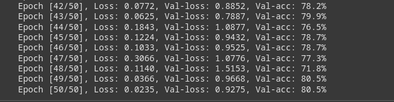
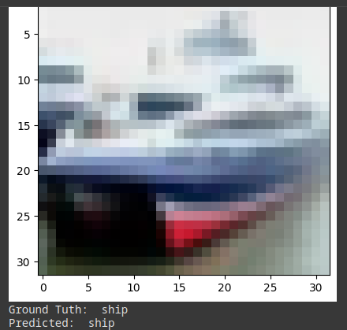
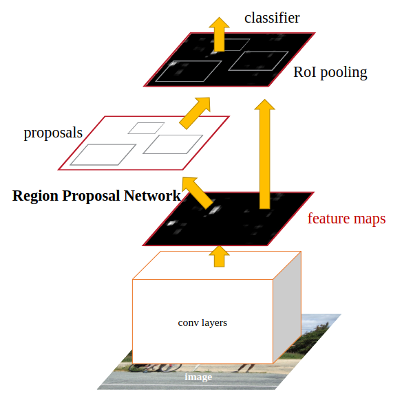
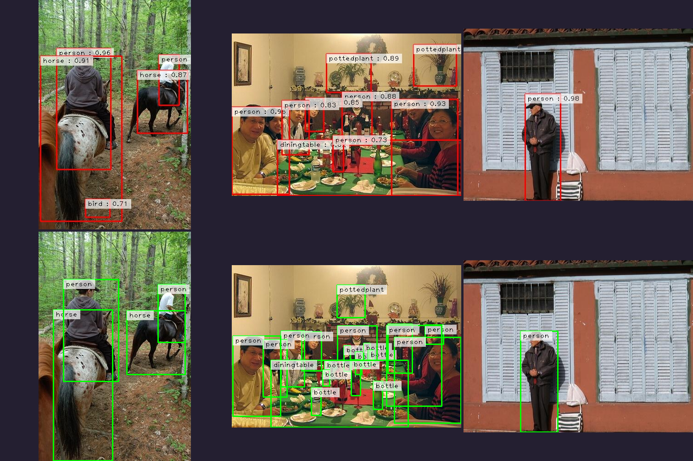

# 1. Classic CNN implementation, for classification applications

A traditional Convolutional Neural Network implementation for image classification on the CIFAR-10 dataset.

## 📊 Results
- **Final Validation Accuracy**: 80.5%
- **Training Epochs**: 50
- **Optimizer**: SGD (lr=0.008)
- **Loss Function**: CrossEntropyLoss

## 🏗️ Architecture
```python
Conv2d(3, 64, kernel_size=4) → ReLU → MaxPool2d(3,2)
Conv2d(64, 192, kernel_size=4) → ReLU → MaxPool2d(3,2)  
Conv2d(192, 384, kernel_size=3) → ReLU
Conv2d(384, 256, kernel_size=3) → ReLU
Conv2d(256, 256, kernel_size=3) → ReLU → MaxPool2d(3,2)
Linear(1024, 512) → ReLU → Dropout(0.5)
Linear(512, 256) → ReLU → Dropout(0.5)
Linear(256, 10)
```

## 📁 Project Structure
```
Classic_CNN/
│
├── classic_cnn.ipynb  # Main training notebook
├── classic_cnn.pt     # Trained model weights
```

## 📸 Screenshots
 - Training Progress: 
 - Classification Sample: 

## 🚀 Features
- Data preprocessing with normalization (mean=[0.4700, 0.4740, 0.4749], std=[0.2485, 0.2502, 0.2537])
- Batch training with DataLoader
- GPU acceleration support


-------
# 2. Faster R-CNN Object Detection in PyTorch

An implementation of **Faster R-CNN** from scratch based on the original paper ["Faster R-CNN: Towards Real-Time Object Detection with Region Proposal Networks"](https://arxiv.org/abs/1506.01497) by Ren et al.

## 🎯 Overview

Faster R-CNN introduces a Region Proposal Network (RPN) that shares convolutional features with the detection network, enabling near real-time object detection. This implementation provides both from-scratch and torchvision-based versions for comprehensive understanding and practical usage.

## 🏗️ Architecture

  
*Faster R-CNN with RPN and ROI pooling*

**Key Components:**
- **Backbone CNN**: Feature extraction (VGG-16)
- **Region Proposal Network (RPN)**: Class-agnostic region proposals with anchors
- **ROI Pooling**: Fixed-size feature extraction from proposals  
- **Detection Head**: Bounding box regression and classification

## 📊 Performance Results

| Model | Backbone | Dataset | mAP@0.5 | Inference Time |
|-------|----------|---------|----------|----------------|
| From Scratch | Custom CNN | VOC 2007 | ~65-70% | ~200ms |
| Torchvision | ResNet-50-FPN | VOC 2007 | ~72-75% | ~150ms |


## 📁 Project Structure
```
Faster_RCNN/
├── config/
│   ├── __init__.py
│   └── voc.yaml                     # Training configuration
├── dataset/
│   ├── __init__.py
│   └── voc.py                       # VOC dataset handling
├── model/                           # From-scratch implementation
│   ├── __init__.py
│   ├── anchor_handling.py
│   ├── core.py
│   ├── faster_rcnn.py
│   ├── region_proposal_network.py
│   └── roi_head.py
├── training/
│   ├── __init__.py
│   └── train.py
├── testing/
├── VOC2007/
└── VOC2007-test/
```

##  Features

- **RPN with Anchors**: Multi-scale anchor boxes (3 scales × 3 ratios)
- **End-to-End Training**: Alternating optimization between RPN and detection
- **VOC 2007 Support**: Pre-configured for PASCAL VOC dataset
- **mAP Evaluation**: Integrated mean Average Precision calculation

## 🛠️ Technical Details

```python
# RPN Configuration
anchors_scales = [128, 256, 512]
anchors_ratios = [0.5, 1.0, 2.0]
rpn_pre_nms_top_n = 12000
rpn_post_nms_top_n = 2000

# Training Parameters
roi_batch_size = 64
positive_fraction = 0.25
bbox_reg_weights = (1.0, 1.0, 1.0, 1.0)
```

## 📸 Training Progress
<!--  -->

RPN and detection loss convergence during training
## 🔍 Detection Examples
  

Sample object detection results on VOC 2007 test set


## 🏃‍♂️ Quick Start

### 1. Setup Environment
- Download [VOC2007](https://universe.roboflow.com/original-voc-2007/original-voc2007/dataset/1) data and place it in the Faster_RCNN\ folder.
- For training:  
```bash
pip install torch torchvision pyyaml opencv-python
python3 -m training.train --config config/voc.yaml
```
- For inference:  
```bash
python -m tools.infer --evaluate False --infer_samples True
```

📚 Reference
```
@inproceedings{ren2015faster,
  title={Faster R-CNN: Towards Real-Time Object Detection with Region Proposal Networks},
  author={Ren, Shaoging and He, Kaiming and Girshick, Ross and Sun, Jian},
  booktitle={Advances in Neural Information Processing Systems},
  year={2015}
} ```
